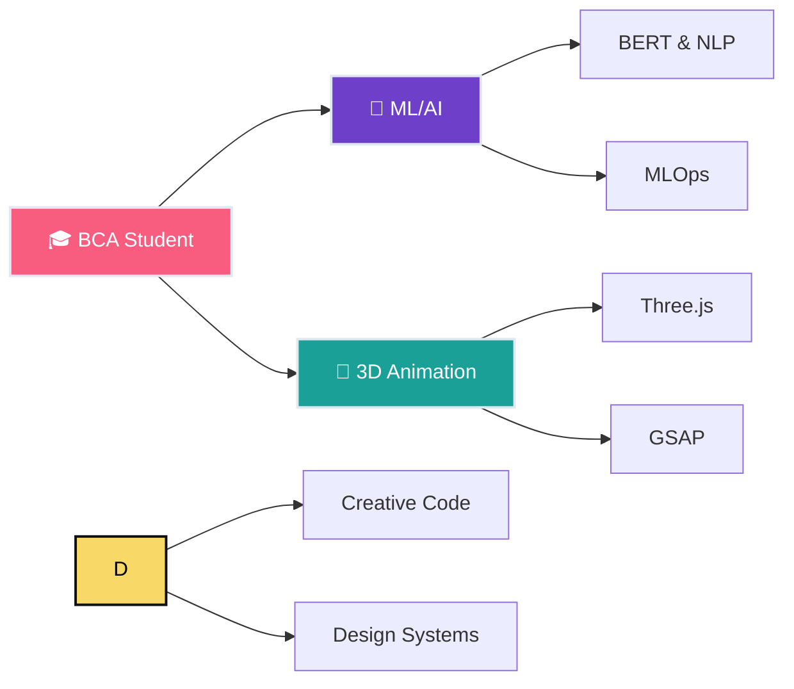

<div align="center">

# 🌊 Hey, I'm Aarica

### BCA Student • ML Explorer • 3D Animation Enthusiast

*Where data meets design, and code becomes art*

[](https://in.linkedin.com/in/aarica-r-588030320)
[](mailto:aaricaraj890@gmail.com)

</div>

---

## 🎨 About Me

```typescript
const aarica = {
    status: "BCA Student @ Learning Everything Mode 🚀",
    skills: "Coding + Design + ML = ✨",
    currentFocus: [
        "Building ML pipelines that actually work",
        "Making data visualizations that don't look boring",
        "Creating 3D experiences that make people go 'woah'"
    ],
    learning: ["MLOps", "Three.js", "GSAP", "BERT", "Vibe Coding"],
    funFact: "I believe every commit should have aesthetic value"
};
```

---

## 🛠️ Tech Stack & Tools

### 🤖 ML/AI & Data Science


### 🎭 Frontend & 3D Animation


### ⚙️ DevOps & MLOps


---

## 📊 GitHub Stats

<div align="center">


</div>

---

## 🚀 Featured Projects

### 🧠 [Sentiment Analysis with BERT](https://github.com/Aaricacoding/sentiment-analysis-bert)
> Deep learning meets NLP: Fine-tuned BERT for sentiment classification
- 🎯 **Tech**: Python, PyTorch, Transformers, BERT
- ✨ **Highlight**: State-of-the-art sentiment detection with custom fine-tuning
- 📈 **Impact**: Understanding emotions in text data

### 🔄 [MLOps Pipeline](https://github.com/Aaricacoding/mlops-pipeline)
> Production-ready ML workflows that scale
- 🎯 **Tech**: Docker, Python, CI/CD, MLflow
- ✨ **Highlight**: End-to-end automated ML pipeline from training to deployment
- 📈 **Impact**: Turning ML experiments into production systems

---

## 🎯 Current Learning Journey



---

## 💭 Philosophy

> **"Code is poetry, ML is magic, and design is the bridge between them."**

I'm on a mission to create experiences that are:
- 🎨 **Beautiful** - Because aesthetics matter
- 🧠 **Intelligent** - Powered by ML & data
- ⚡ **Smooth** - Animated with purpose
- 🌍 **Impactful** - Solving real problems

---

## 📫 Let's Connect!

I'm always excited to collaborate on:
- 🤖 ML/AI projects with creative applications
- 🎨 Interactive 3D web experiences
- 📊 Data visualization that tells stories
- 🚀 Open source contributions

**Reach out:** [aaricaraj890@gmail.com](mailto:aaricaraj890@gmail.com) | [LinkedIn](https://in.linkedin.com/in/aarica-r-588030320)

---

<div align="center">

### ⚡ "Learning everything, vibing always, shipping constantly"


</div>
